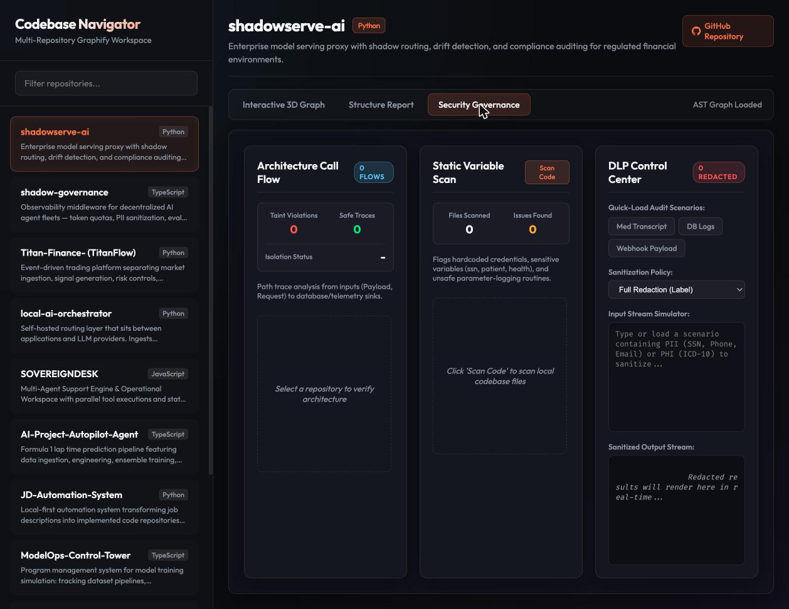
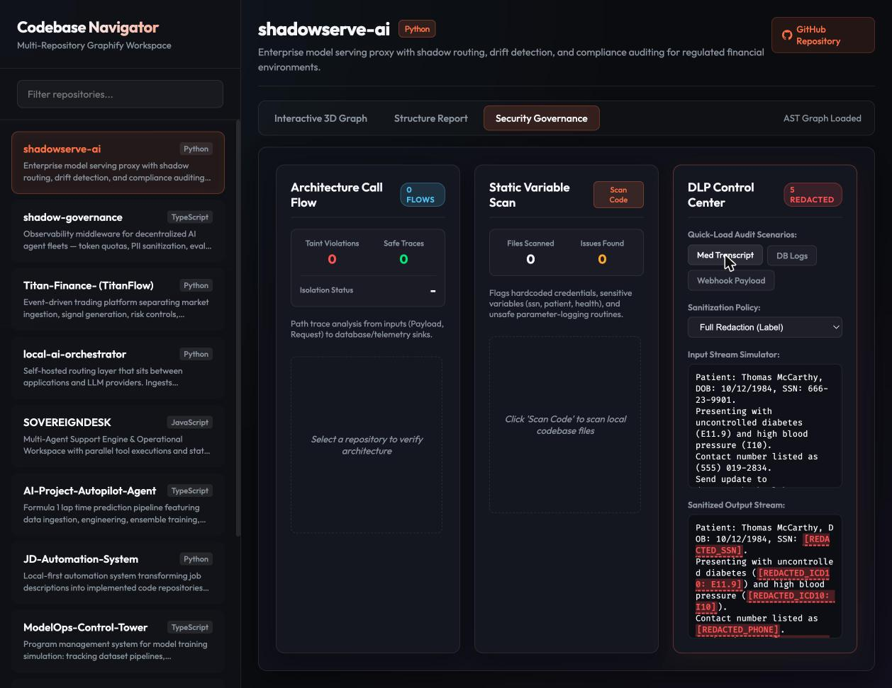

# Portal Security

### PII/PHI Security Audit & DLP Control Center

An interactive, client-side security governance portal for auditing repository architecture, running static analysis scans, and simulating Data Loss Prevention (DLP) sanitization for PII/PHI — all in the browser, with zero data leaving the host.


---

## Table of Contents

- [Overview](#overview)
- [Screenshots](#screenshots)
- [Key Capabilities](#key-capabilities)
- [Architecture](#architecture)
- [Getting Started](#getting-started)
- [Generating Graph Data](#generating-graph-data)
- [Security & Privacy](#security--privacy)
- [Project Structure](#project-structure)
- [License](#license)

---

## Overview

Portal Security is a single-page governance workspace that consolidates three security workflows into one console: architecture call-flow verification, static variable scanning, and a live Data Loss Prevention (DLP) playground. It is designed for regulated environments where engineering teams need to demonstrate that untrusted inputs never reach logging or telemetry sinks unredacted, and that PII/PHI is consistently sanitized before egress.

Everything runs client-side. The portal reads pre-generated AST graph artifacts and performs sanitization entirely in the browser, so sensitive sample data is never transmitted to a remote server.

---

## Screenshots

### Multi-Repository Workspace

The Codebase Navigator provides a filterable, multi-repository workspace for selecting an audit target and switching between analysis views.


### Security Governance Dashboard

A consolidated three-panel governance view covering architecture call-flow analysis, static variable scanning, and the DLP Control Center.



### DLP Playground in Action

Pre-loaded audit scenarios demonstrate real-time redaction. Below, a medical transcript is sanitized end-to-end — SSNs, ICD-10 codes, and phone numbers are detected and replaced with labeled redaction tokens.



---

## Key Capabilities

### Architecture Verification — Graphify Call-Flow Audit

Traces call paths across the codebase using AST graph data, audits sanitizer placement, and flags taint violations where untrusted inputs reach logging or telemetry sinks directly. It also verifies isolation between raw database models and telemetry log systems, surfacing safe traces and isolation status at a glance.

### Static Variable Scanning — Semgrep-Style Rules

Performs lightweight static analysis across codebase files to detect unsafe parameter-logging routines (for example, log functions accepting `patient`, `health`, or `ssn` arguments), hardcoded credentials, secret keys, and sensitive variable names.

### Data Loss Prevention — DLP Playground

A simulated live ingestion scanner that detects and redacts sensitive PII/PHI elements including Social Security Numbers, phone numbers, email addresses, and ICD-10 medical codes. It ships with pre-loaded audit scenarios — Medical Transcripts, Database Logs, and Webhook API Payloads — and a configurable sanitization policy so teams can validate redaction behavior instantly.

---

## Architecture

The portal is a static, dependency-light front end composed of two HTML entry points and a set of generated graph artifacts:

- A presentation layer renders the navigator, the analysis tabs, and the DLP console.
- A data layer loads per-repository AST artifacts (`graph.json` and `GRAPH_REPORT.md`) produced by the Graphify pipeline.
- A sanitization engine applies the selected redaction policy to the input stream and renders the sanitized output in real time.

Because the analysis artifacts are pre-generated and the sanitization runs locally, the portal has no server-side runtime requirement beyond a static file host.

---

## Getting Started

Clone the repository, run the required build, and serve the generated `dist` directory. The build synchronizes locally available Graphify outputs, verifies every configured repository has complete artifacts, and packages them with the portal.

```bash
# Clone the repository
git clone https://github.com/jacattac314/portal-security.git
cd portal-security

# Build and verify the static portal
npm run build

# Serve the generated site
python3 -m http.server 8080 --directory dist
```

Then open the portal in your browser:

```
http://127.0.0.1:8080/portal.html
```

The DLP Playground and Security Governance views are available immediately using the built-in audit scenarios.

---

## Generating Graph Data

The Architecture and Structure Report views render data produced by the Graphify pipeline. For each repository under audit, the portal expects the following artifacts:

```
<repo>/graphify-out/graph.json
<repo>/graphify-out/graph.html
<repo>/graphify-out/GRAPH_REPORT.md
```

Repository mappings live in `graphify-artifacts.json`. The sync step searches `GRAPHIFY_SOURCE_ROOTS`, `~/Documents/antigravity`, and `~/.graphify/repos/jacattac314` for generated outputs. Update source repositories with Graphify, then run:

```bash
npm run graphify:sync
npm run build
```

`npm run build` always runs artifact sync and verification before creating `dist`. It fails when any required artifact is absent or malformed, including in CI.

The repository also includes the `portal-security-build` Codex skill under `.codex/skills/`. It defines the same mandatory build and browser-verification workflow for future agent changes.

---

## Security & Privacy

The portal is built around a data-minimization principle. All sanitization and analysis happen in the browser, sample PII/PHI is never sent to a remote endpoint, and the only network activity is fetching the locally hosted, pre-generated graph artifacts. This makes it suitable for demonstration in regulated environments without exposing real sensitive data.

---

## Project Structure

```
portal-security/
├── portal.html     # Main governance portal (navigator, analysis tabs, DLP console)
├── index.html      # Entry point
├── graphify-artifacts.json
├── scripts/        # Artifact sync, verification, and static build
├── <repo>/graphify-out/
├── docs/           # Documentation assets and screenshots
└── README.md
```

---

## License

Released under the MIT License. See `LICENSE` for details.
